# lcs-gpu

Longest common substring of two 100-million-character strings, solved three ways: a
linear-time serial reference (SA-IS suffix array), an OpenMP solver (k-mer hash index
with AVX2 match extension) and a CUDA solver (prefix-doubling suffix array built with
Thrust radix sort).

> **Course assignment.** This was Assignment 1 of the Parallel Programming course
> (M.Tech CDS, IISc, 2026). It was graded. The code is shared as a record of the work,
> not as a solution set to copy.

**Headline (N = 10^8 per string, one node, 30 timed runs per parallel configuration):**
the CUDA solver averages **0.6490 s** (SD 0.0082 s, 95% CI ±0.0029 s). It is **3.17x**
faster than OpenMP at 32 threads (2.0562 s), **3.13x** faster than 64 threads
(2.0298 s), and 53.64x faster than the single-threaded SA-IS reference (34.8076 s).

---

## Problem

Given two strings X and Y, each 10^8 characters drawn uniformly from `A`-`Z`, report the
length of their longest common substring. Only the computation is timed; generating the
strings is not. The assignment asked for a GPU solution and an OpenMP solution for the
CPU cores of the same node.

The textbook dynamic program is O(|X|·|Y|) = 10^16 cell updates, which rules it out.
All three solvers here are near-linear in practice.

## Approach

The two parallel solvers use different algorithms. Each one is a better fit for its own
hardware.

```mermaid
flowchart TB
    gen["X, Y: 1e8 random chars each<br/>(not timed)"]

    subgraph SER["Serial reference - src/lcs_serial.cpp"]
        s1["S = X + sep + Y + end"] --> s2["SA-IS suffix array, O(N)"]
        s2 --> s3["Kasai LCP array, O(N)"]
        s3 --> s4["max LCP over adjacent suffixes<br/>where one starts in X and one in Y"]
    end

    subgraph OMP["OpenMP - src/lcs_openmp.cpp"]
        o1["encode every 7-mer of X<br/>as a 35-bit code (parallel for)"] --> o2["insert codes into an<br/>open-addressing table (single thread)"]
        o2 --> o3["parallel for over Y positions:<br/>probe 7-mer, extend left (scalar)<br/>and right (AVX2, 32 bytes per compare)"]
        o3 --> o4["reduction(max)"]
    end

    subgraph GPU["CUDA - src/lcs_cuda.cu"]
        c1["S = X + sep + Y + end<br/>copy to device, rank = char"] --> c2["pack 64-bit key<br/>(rank[i], rank[i+k])"]
        c2 --> c3["thrust::sort_by_key<br/>(CUB radix sort)"]
        c3 --> c4["adjacent_difference + inclusive_scan<br/>gives new ranks, then scatter"]
        c4 -- "ranks not yet unique: k = 2k" --> c2
        c4 -- "all ranks unique" --> c5["fused kernel: for each adjacent SA pair<br/>with one suffix in X and one in Y:<br/>compare chars, atomicMax(length)"]
    end

    gen --> SER
    gen --> OMP
    gen --> GPU
```



**Why a suffix array answers the question.** Join the strings as `S = X # Y $`. Any common
substring of X and Y is a common prefix of one suffix that starts in X and one that starts
in Y. After sorting all suffixes, the longest such prefix always shows up between two
*adjacent* suffixes in sorted order, one from each side of `#`. So the answer is the
maximum LCP over adjacent pairs that straddle the separator.

```
sorted suffixes of S = X # Y $    from   LCP with previous
  ...
  KQZA#...                        X
  KQZAB...$                       Y      4   <- straddles X|Y: candidate
  KQZB...                         X      3   <- straddles X|Y: candidate
  ...
answer = max LCP over straddling neighbours = 4
```

**Serial reference (SA-IS + Kasai).** SA-IS (Nong, Zhang and Chan) builds the suffix array
in O(N) by induced sorting. Kasai's algorithm then builds the LCP array in O(N). The SA-IS
routine follows the reference implementation published with the SA-IS paper. This solver
is the correctness oracle. It is not a tuned baseline: on the same input it is several
times slower than the OpenMP solver run on one thread (see Limitations).

**OpenMP (k-mer index + SIMD extension).** Every 7-mer of X is packed into a 35-bit code
(5 bits per letter) and stored with its position in a power-of-two open-addressing table
(`key << 27 | position`). Threads then sweep Y with `schedule(dynamic, 32768)`. For every
7-mer hit, a thread extends the match leftwards with scalar compares and rightwards with
AVX2 `_mm256_cmpeq_epi8` (32 bytes per compare). A `reduction(max)` combines the results.
On random text the expected answer (about 11-12) is well above k = 7, so every maximal
match contains a seed and the search is exact. If no 7-mer is shared, the solver falls back
to an exact diagonal scan.

**CUDA (prefix doubling).** SA-IS is recursive and sequential, so it does not map well to
a GPU. Prefix doubling (Manber and Myers) does. In round k, each suffix gets a 64-bit key
`(rank[i], rank[i+k])`. CUB's radix sort orders the keys. `adjacent_difference` and
`inclusive_scan` then assign new ranks, and `scatter` writes them back. The loop stops as
soon as every rank is unique, which took 4 rounds on random input. A single fused
grid-stride kernel then visits adjacent suffix-array entries, keeps only the pairs that
straddle `#`, measures their common prefix by direct comparison, and folds the result into
one `atomicMax`. This skips building a full LCP array.

## Results

Hardware: one node of a shared teaching cluster. The node has 1x Intel Xeon Platinum
8352V (36 cores, 72 hardware threads, 2.1 GHz), about 125 GB RAM, and 1x NVIDIA RTX A5000
(24 GB, sm_86, driver 550 / CUDA 12.4). Builds used `g++ -O3 -march=native -fopenmp` and
`nvcc -O3 -arch=sm_86`. Runs used `OMP_PROC_BIND=close` and `OMP_PLACES=cores`. Every
timed run used freshly generated random strings with N = 10^8 each.

Source: [`results/benchmark_30trial_feb13.txt`](results/benchmark_30trial_feb13.txt). The
same rows, recomputed from the per-run times, are in [`results/summary.csv`](results/summary.csv).

| Configuration       | Runs | Mean (s) | Std dev (s) | 95% CI (s) | CUDA speedup over it | Speedup vs serial |
|---------------------|-----:|---------:|------------:|-----------:|---------------------:|------------------:|
| Serial (SA-IS)      |    5 |  34.8076 |      0.1244 |    ±0.1090 |               53.64x |             1.00x |
| OpenMP, 16 threads  |   30 |   2.1568 |      0.0075 |    ±0.0027 |                3.32x |            16.14x |
| OpenMP, 32 threads  |   30 |   2.0562 |      0.0075 |    ±0.0027 |                3.17x |            16.93x |
| OpenMP, 64 threads  |   30 |   2.0298 |      0.0070 |    ±0.0025 |                3.13x |            17.15x |
| OpenMP, 72 threads  |   30 |   2.0277 |      0.0069 |    ±0.0025 |                3.12x |            17.17x |
| **CUDA (RTX A5000)**|   30 | **0.6490** |  0.0082 |    ±0.0029 |                1.00x |            53.64x |

How to read the speedups:

- "CUDA speedup over it" is the mean time of that row divided by the CUDA mean. The
  benchmark script printed 3.17x (vs 32 threads) as its headline. The fastest OpenMP
  configuration was actually 72 threads, and against that the GPU is 3.12x faster.
- "Speedup vs serial" compares *different algorithms*. The serial SA-IS solver does more
  work per character than the k-mer solver. So most of the 17x OpenMP figure (and part of
  the 53.64x CUDA figure) comes from the algorithm, not from parallelism.
- **OpenMP strong scaling is poor.** Relative to 16 threads, the speedup is 1.05x at 32
  threads, 1.06x at 64 and 1.06x at 72. That is a parallel efficiency of 52.5%, **26.5%**
  and 23.6%. (The script computed these from the rounded speedups; unrounded, 64 threads
  gives 26.6%.) The main cause is that the hash table is filled by a single thread. A local
  phase timing of the same code at N = 10^7 on a 16-thread laptop showed the cost: the
  parallel probe phase sped up about 6x from 1 to 16 threads, but the serial table build
  stayed at roughly 0.6-1.4 s and became most of the runtime. Random-access table probes
  bound by memory latency make it worse.

**Re-run on another node.** [`results/benchmark_30trial_feb25_rerun.txt`](results/benchmark_30trial_feb25_rerun.txt)
repeats the benchmark with the same code, 5 unmeasured warm-up runs per configuration, and
an extra 36-thread configuration, on a different node of the same cluster. The GPU result
reproduced: 0.6469 s against 0.6490 s. The CPU side did not. The serial solver averaged
44.7658 s and OpenMP 3.38-3.54 s, so the CUDA-over-OpenMP ratio became 5.23x-5.48x. The
cause was not investigated. Read the CPU numbers as node-dependent and the GPU number as
stable.

**Where the GPU time goes.** One Nsight Systems run at N = 10^8
([`results/cuda_nsys_profile_feb25.txt`](results/cuda_nsys_profile_feb25.txt), 0.7177 s
total) breaks down as follows:

| Phase | Time (s) | Share of run |
|---|---:|---:|
| Suffix-array construction (4 doubling rounds) | 0.4445 | 62% |
| Fused LCP/max kernel | 0.0846 | 12% |
| Host-to-device copy of 200 MB | 0.0240 | 3% |
| Allocation, host-side concatenation and frees (inside the timed region) | about 0.16 | about 23% |

Radix-sort kernels account for 44.2% of GPU kernel time.

**Earlier approach.** The first version used binary search over the answer length, with
double rolling hashes (Rabin-Karp) checking whether a common substring of a given length
exists. Its 30-run benchmark
([`results/earlier_rolling_hash_feb01.txt`](results/earlier_rolling_hash_feb01.txt))
measured CUDA at 32.531 s and OpenMP at 961.397 s with 36 threads, a 29.55x GPU advantage.
In absolute time, the current GPU solver is about 50x faster than that version (32.531 s
to 0.6490 s). The current OpenMP solver at 72 threads is about 446x faster (904.646 s to
2.0277 s). The earlier version's source is not included here.

## Correctness

- **Shared-seed debug job** (`scripts/slurm_debug.sh`). All three solvers run on the same
  seeded 2,000-character strings. In this mode the OpenMP solver uses its exact diagonal
  scan, and the CUDA solver runs its normal pipeline. Both matched the SA-IS reference in
  the logged cluster runs (answers 4 and 5 for two different seeds).
- **Fast-path cross-check** (`scripts/cross_check.sh`, `make check-cpu`). The debug job
  never exercises the OpenMP k-mer path, so this script runs the benchmark code paths on
  shared seeded inputs and compares the answers with SA-IS. It covers N = 10^3, 10^5, 10^6
  and 10^7, with 3 seeds each. All 12 cases match on a CPU-only machine (answers from 4
  to 10). The script also compares CUDA when `bin/lcs_cuda` exists. That has not been run
  yet, because no GPU was available after the course.
- At N = 10^8 the solvers were not compared on identical inputs. Benchmark runs draw fresh
  random strings each time. The answers they print (10-12) are in the range expected for
  random text over 26 letters.

## Build and run

Requirements: g++ with OpenMP and AVX2 (any recent GCC), and the CUDA toolkit with Thrust
for the GPU solver. The default target is `sm_86`; override it with `GPU_ARCH`.

```bash
make cpu                       # bin/lcs_serial, bin/lcs_openmp (no nvcc needed)
make all GPU_ARCH=sm_86        # adds bin/lcs_cuda
make check-cpu                 # seeded serial vs OpenMP cross-check

./bin/lcs_serial 100000000 0         # benchmark mode, random input
./bin/lcs_openmp 100000000 0 42      # optional 3rd argument: seed
./bin/lcs_cuda   100000000 1 42      # mode 1 = debug size (N = 2000)
```

Every binary prints `Time: <seconds>` and `Result: <length>`. The CUDA binary also prints
per-phase times.

SLURM: the scripts contain `#SBATCH --partition=<partition>` as a placeholder. Override it
on the command line, or edit it (and add `--account=<account>` if your site needs one).
Submit from the repository root. The scripts `cd` to `$LCS_ROOT` if it is set, otherwise
to the submit directory, and they write `lcs_*_<jobid>.txt` logs there.

```bash
sbatch --partition=<partition> scripts/slurm_debug.sh       # build + shared-seed check
sbatch --partition=<partition> scripts/slurm_benchmark.sh   # 5 serial + 30 runs per config
sbatch --partition=<partition> scripts/slurm_profile.sh     # Nsight Systems timeline (+ TAU if present)
```

Each job requests one node, 72 CPUs and one GPU (`--gres=gpu:1`).

## Repository layout

```
src/        lcs_serial.cpp, lcs_openmp.cpp, lcs_cuda.cu, random_text.hpp
scripts/    slurm_debug.sh, slurm_benchmark.sh, slurm_profile.sh, run_lcs.sh, cross_check.sh
results/    benchmark logs (host names removed), summary.csv, CUDA profile excerpt
Makefile    builds into bin/
```

## Limitations

- **Serial table build caps OpenMP scaling.** This is the 26.5% efficiency at 64 threads.
  The fix would be a parallel build: lock-free linear probing with a CAS per slot, or
  partitioning keys by hash prefix across threads. That was not done within the assignment.
- **The serial baseline is a different algorithm.** Speedups against it mix algorithmic
  and parallel gains. A fair parallel-scaling baseline is OpenMP on one thread.
- **The k-mer path assumes random-like text.** It needs the answer to be at least 7. If
  it is shorter, the solver falls back to an O(|X|·|Y|) diagonal scan. Highly repetitive
  input (for example `AAAA...`) gives long probe chains and repeated extensions, which can
  push it towards quadratic time. The alphabet must fit in 5 bits per letter (`A`-`Z`),
  and positions must fit in 27 bits (about 134M per string).
- **The CUDA LCP step costs the sum of the adjacent common prefixes.** That is cheap for
  random text but grows on repetitive text. Prefix doubling also needs more rounds as the
  longest repeat grows. 32-bit indices limit the combined length to under 2^31.
- **What is timed.** The CUDA timing includes device allocation, host-side concatenation
  and the 200 MB host-to-device copy. That is conservative for the GPU.
- **Measurement scope.** The serial mean comes from 5 runs only. Everything ran on one
  node of a shared cluster, and the re-run shows node-to-node variation on the CPU side.

## References

- G. Nong, S. Zhang, W. H. Chan. "Two Efficient Algorithms for Linear Time Suffix Array
  Construction." *IEEE Transactions on Computers* 60(10), 2011. (SA-IS)
- T. Kasai, G. Lee, H. Arimura, S. Arikawa, K. Park. "Linear-Time Longest-Common-Prefix
  Computation in Suffix Arrays and Its Applications." *CPM*, 2001.
- U. Manber, G. Myers. "Suffix Arrays: A New Method for On-Line String Searches."
  *SIAM Journal on Computing* 22(5), 1993. (prefix doubling)
- R. M. Karp, M. O. Rabin. "Efficient Randomized Pattern-Matching Algorithms." *IBM
  Journal of Research and Development* 31(2), 1987. (rolling hash, earlier approach)
- D. Merrill, A. Grimshaw. "High Performance and Scalable Radix Sorting." *Parallel
  Processing Letters* 21(2), 2011. (basis of CUB/Thrust radix sort)
- N. Bell, J. Hoberock. "Thrust: A Productivity-Oriented Library for CUDA." *GPU
  Computing Gems, Jade Edition*, 2011.
- D. Gusfield. *Algorithms on Strings, Trees, and Sequences.* Cambridge University
  Press, 1997. (longest common substring via generalized suffix structures)
- A. Grama, A. Gupta, G. Karypis, V. Kumar. *Introduction to Parallel Computing*, 2nd ed.
  Addison-Wesley, 2003.

## Context

Course assignment, Parallel Programming, M.Tech CDS, IISc, 2026.

## License

MIT. See [LICENSE](LICENSE).
